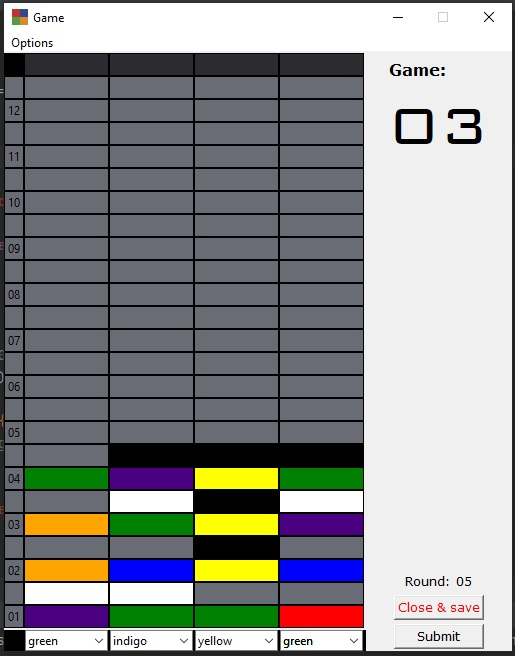
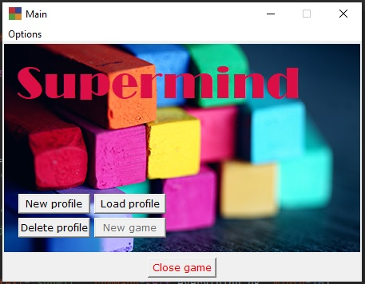

# Supermind
 Classic colour code-breaking game.

The script is entirely written in Python, and using only standard libraries.

###### Photo by <a href="https://www.pexels.com/@mccutcheon">Sharon McCutcheon</a> from Pexels

# Work In Progress

**Game is not ready, I'm still working on it!**

# The game

The player, as the codebreaker, tries to guess the pattern, in both order and color, within a set number of rounds. 
Each guess is made by placing a row of coloured tags on the decoding board. 
Once placed, the script, as the code maker, provides feedback by placing  coloured tags on top of the row with the guess. 
A black key tag is placed for each code tag from the guess which is correct in both color and position. A white key tag
indicates the existence of a correct color code tag placed in the wrong position.

- Classic mode:
If there are duplicate colours in the guess, they cannot all be awarded a key tag unless they correspond to the same 
number of duplicate colours in the hidden code.

- Extra hard mode:
Duplicate colours don't count towards code limit. If secret code contains two of the same colour, and you place four
of that colour, two of them will be black, and two will be white.

Once feedback is provided, another guess is made; guesses and feedback continue to alternate until either the codebreaker 
guesses correctly, or all rows of the decoding boards are full.

info and game rules from [wikipedia](https://en.wikipedia.org/wiki/Mastermind_(board_game))

# Installation

- Install python from https://www.python.org/ (_built under python 3.9_)
- Download repository [supermind.git](https://github.com/Jaime-alv/supermind.git)
- Run main.py (located inside supermind folder)
- Enjoy the game!

No need to install any other libraries; a basic, clean python installation is all is required.

# The script

## Main Window

From this window you can create, delete or load a profile. 

 - New profile: Every player needs a profile. Hitting this button will let you create a new one.
 - Load profile: If there are any profiles saved, here you can load them. After selecting a profile, you
will be prompted with the new game window. 
 - Delete profile: delete the selected profile from the computer.
 - New game: if there is a profile loaded, you can start a new game from here. Write your desired number of games and hit
 any of the four buttons above with the difficulty label. There are four difficulties to choose from, easy, normal, hard
and custom.

   - Easy: 6 different colours, 3 holes and 12 rounds.
   - Normal: 6 different colours, 4 holes and 12 rounds.
   - Hard: 8 different colours, 5 holes and 14 rounds.
   - Custom: you can customize your experience here with: Up to 8 different colours; up to 10 holes; up to 50 rounds 
   in each game.

### Important!:
When loading a profile, if there is an ongoing game, script will ask you if you would like to continue it. If affirmative,
you will be taken to said game, if you answer "no", that game will be deleted!

## Board Window

This is the game window. Secret code is at the top and your choices at the bottom.
Each time you submit a round, your colour choices will be displayed at a new line, the closer you are to the top, fewer
tries you have left.
 - Black: right colour in the right position.
 - White: right colour, wrong position.
 - Grey/None: colour is not in the secret code.

On the left side you can find the game board.

On the right side, you can see:
- Game counter: current game you're playing.
- Round counter: current round you're about to submit.
- Submit button: for submitting your code.
- Close: Close this window and take you to the main window, the game will save its state, so you can continue it later.

## Options menu

In the Options menu, you can get information about the script itself, your statistics, or load a different profile. 

## Help menu
In here you can find the game rules or the game's settings.

###### Copyright (C) 2021 Jaime Alvarez Fernandez

